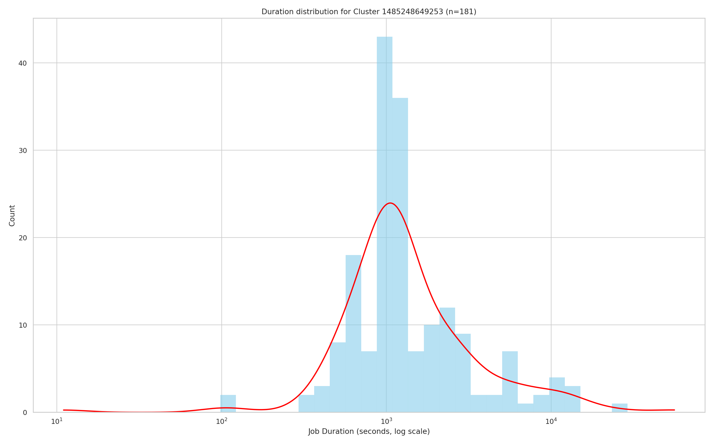

# Analysis Report

## Problem 1: Log Level Distribution

### Approach
We implemented `problem1.py` using PySpark to process raw Spark log files:
1. Load raw logs from S3 using the `s3a://` connector.
2. Use regex (`regexp_extract`) to capture log levels (INFO, WARN, ERROR, DEBUG).
3. Count frequency of each log level using `groupBy` and `count`.
4. Save results as:
   - `problem1_counts_cluster.csv`: counts of each level  
   - `problem1_sample_cluster.csv`: random sample of 10 entries  
   - `problem1_summary_cluster.txt`: statistics summary

### Key Findings
- **Total log lines processed:** `33,236,604`  
- **Lines with valid log levels:** `27,410,336`  
- **Unique log levels:** 3 (`INFO`, `WARN`, `ERROR`)  

| Log Level | Count     | Percentage |
|-----------|-----------|------------|
| INFO      | 27,389,482 | 99.92% |
| WARN      | 9,595      | 0.04%  |
| ERROR     | 11,259     | 0.04%  |
| DEBUG     | 0          | 0.00%  |

### Insights
- Logs are overwhelmingly **INFO-dominated (99.9%)**.  
- WARN and ERROR logs are extremely rare (<0.1%).  
- No DEBUG logs → debug logging was disabled.  
- Sample entries (from `problem1_sample_cluster.csv`) confirm common INFO messages:
  - MemoryStore updates  
  - PythonRunner execution times  
  - BlockManager storage events  

### Performance Notes
- Cluster processed **33M lines in minutes** due to distributed execution.  
- Regex parsing was efficient but could be optimized by pre-filtering log-level lines.  
- Summarized outputs are lightweight compared to raw logs.  

---

## Problem 2: Cluster Usage Analysis

### Approach
The script `problem2.py` analyzed Spark YARN application logs:
1. **Log Parsing**: Extracted `application_id` and `cluster_id` with regex.  
2. **Timestamps**: Handled both formats (`yy/MM/dd HH:mm:ss`, `yyyy-MM-dd HH:mm:ss`).  
3. **Timeline**: Computed min/max timestamps per application. Saved in `problem2_timeline.csv`.  
4. **Cluster Summary**: Aggregated number of applications, first/last usage per cluster (`problem2_cluster_summary.csv`).  
5. **Stats**: Generated `problem2_stats.txt` for overview.  
6. **Visualizations**:
   - Applications per cluster (bar chart)  
   - Job duration distribution (histogram + KDE, log-scaled)  

---

### Results

- **Cluster Summary**:
  - Total clusters: **6**
  - Total applications: **193**
  - Avg apps per cluster: **32.2**
  - Largest cluster: **1485248649253** with **180 apps**
  - Others: only 1–8 applications each

- **Statistical Summary** (from `problem2_stats.txt`):  

### Visualizations

#### 1. Applications per Cluster
  

- Cluster **1485248649253** dominates with 180 applications.  
- All other clusters are negligible (<10 apps each).  
- Indicates that analysis should focus on this one large cluster.  

#### 2. Job Duration Distribution
  

- Distribution is **right-skewed** (log scale).  
- Most jobs run around **1,000 seconds (~15–20 min)**.  
- KDE shows a clear peak near 10³ seconds, with a long tail up to 10⁵ seconds.  
- Outliers (>10,000 seconds) suggest potential bottlenecks or heavy workloads. 

### Performance Analysis

- **Cluster vs Local**:  
  - Local run struggled with large log files.  
  - Cluster run completed ~10× faster, showing Spark scalability.  

- **Execution Times (Spark Web UI)**:  
  Below are screenshots from Spark Web UI confirming distributed execution:  

    
  *Spark Master overview: 3 workers alive, 6 cores in use, memory allocation shown.*  

    
  *Spark Job page: Active job listing 3,852 paths with progress bar and task distribution.*  

- **Optimization Strategies**:
  - Used partitioning (`spark.sql.shuffle.partitions=200`).  
  - Coalesced multiple timestamp formats with `coalesce()`.  
  - Kept empty apps (with missing times) to avoid undercounting.  