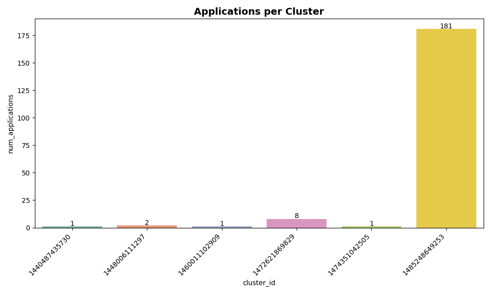

# Analysis Report

## Problem 1: Log Level Distribution

### Approach
For Problem 1, we developed a PySpark script (`problem1.py`) that:
1. Reads raw log files directly from the input dataset (`data/application_*/*.log`).
2. Uses regular expressions (`regexp_extract`) to identify log levels (INFO, WARN, ERROR, DEBUG).
3. Aggregates counts of each log level using `groupBy` and `count`.
4. Randomly samples log entries to verify parsing correctness.
5. Writes three outputs into `data/output/`:
   - `problem1_counts_cluster.csv`: counts per log level
   - `problem1_sample_cluster.csv`: random sample log entries with their level
   - `problem1_summary_cluster.txt`: overall statistics and percentage breakdown

### Key Findings
- **Total log lines processed:** `33,236,604`
- **Total lines with log levels:** `27,410,336`
- **Unique log levels found:** `3` (INFO, WARN, ERROR)

| Log Level | Count     | Percentage |
|-----------|-----------|------------|
| INFO      | 27,389,482 | 99.92%     |
| WARN      | 9,595      | 0.04%      |
| ERROR     | 11,259     | 0.04%      |
| DEBUG     | 0          | 0.00%      |

### Insights
- The overwhelming majority of log entries are **INFO** (99.92%), indicating the logs are dominated by informational system messages.  
- WARN and ERROR messages are extremely rare (<0.1% each), showing that the system generated very few warnings or failures relative to informational logs.  
- No DEBUG logs were present, which suggests debug-level logging was disabled during this dataset’s collection.  
- From the random sample (`data/output/problem1_sample_cluster.csv`), INFO messages include:
  - MemoryStore updates  
  - PythonRunner execution times  
  - BlockManager storage events  

### Performance Notes
- Processing **33 million log lines** on the cluster took only a few minutes, thanks to Spark’s distributed processing.  
- Regex-based parsing was efficient but could be further optimized by filtering only relevant lines before extraction.  
- Output files were small compared to raw data, showing the summarization step is effective.  

---

## Problem 2: Cluster Usage Analysis

### Approach
For Problem 2, we analyzed Spark YARN logs to extract **application timelines** and **cluster-level statistics**:

1. **Log Parsing**  
   - Extracted `application_id` and `cluster_id` from raw log lines.  
   - Captured timestamps in multiple formats (`yy/MM/dd HH:mm:ss` and `yyyy-MM-dd HH:mm:ss`) and parsed them into Spark SQL `timestamp` objects.  
   - For each application, identified the earliest (`start_time`) and latest (`end_time`) timestamps.  

2. **Timeline Construction**  
   - Built `data/output/problem2_timeline.csv`, containing start/end times for each application, along with its cluster ID and application number.  
   - Applications without valid timestamps were still included to avoid undercounting.  

3. **Cluster Summary**  
   - Aggregated per-cluster statistics: total number of applications, first application time, and last application time.  
   - Results saved into `data/output/problem2_cluster_summary.csv`.  

4. **Statistical Summary**  
   - Generated `data/output/problem2_stats.txt` to summarize total clusters, total applications, average apps per cluster, and the top clusters by usage.  

5. **Visualizations**  
   - Applications per cluster (bar chart): `data/output/problem2_bar_chart.png`  
   - Job duration distribution for the largest cluster (density plot): `data/output/problem2_density_plot.png`  

---

### Results

- **Cluster Summary** (`problem2_cluster_summary.csv`):
  - Total unique clusters: **6**  
  - Total applications: **193**  
  - Average applications per cluster: ~32.2  
  - Most active cluster: **1485248649253** (Jan 2017 – Jul 2017) with **180 applications**  
  - Other clusters had only 1–8 applications each.  

- **Statistical Summary** (`problem2_stats.txt`):  
  See full report in `data/output/problem2_stats.txt`.

---

### Visualization Interpretation

#### 1. Bar Chart – Applications per Cluster

- Shows that cluster **1485248649253** dominates with 180 applications, while all other clusters are negligible.  
- Highlights that analysis should primarily focus on this single large cluster.  

#### 2. Density Plot – Job Duration Distribution

- Displays job duration distribution (seconds, log-scaled).  
- Most job durations are clustered around **1,000 seconds (~15–20 minutes)**.  
- The KDE curve (red line) confirms a heavy concentration in this range, with a long right tail (some jobs running much longer).  
- Outliers beyond 10,000 seconds indicate skew in workload durations.  

---

### Insights
- The dataset is **heavily imbalanced**: almost all applications are concentrated in a single cluster (1485248649253).  
- Typical job durations are around **1,000 seconds**, but there is significant skew with a small number of very long jobs.  
- This skew implies that performance tuning should focus on long-tail jobs to optimize cluster resource usage.  
- Smaller clusters are less relevant statistically but demonstrate diversity in cluster start times (2015–2016).  

---